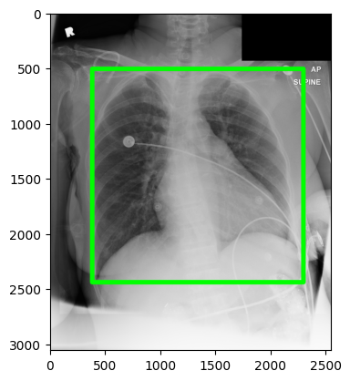

# Visualisation tools for REFLACX data

This notebook provides sample usage of the tools made for visualization of REFLACX data.

REFLACX data is available [here](https://physionet.org/content/reflacx-xray-localization/1.0.0/). The dataset's code is available in [this repo](https://github.com/ricbl/eyetracking).

MIMIC-CXR data, REFLACX parent dataset, is available [here](https://physionet.org/content/mimic-cxr/2.0.0/).

## Retrieving Metadata

Data should be already downloaded, see get_data.ipynb


```python
full_meta_path = 'full_meta.json' # if file doesnt exist, it will be created
reflacx_dir = "../data/reflacx"
mimic_dir = "../data/mimic/reflacx_imgs"
```


```python
from metadata import Metadata
```

REFLACX's original data structure divides the trials by id, each one corresponding to a MIMIC-CXR x-ray. More than one id can be associated to the same x-ray. So, the first step is loading reflacx metadata grouped by x-ray, making each xray contain references to each REFLACX observation that references it.


```python
metadata = Metadata(reflacx_dir, mimic_dir, full_meta_path)
```

    loading metadata
    metadata loaded from file


## Visualisation


```python
from matplotlib import pyplot as plot
import numpy as np
import cv2
```

### Load sample

List first MIMIC-CXR dicom ids


```python
metadata.list_dicom_ids(10)
```


```python
sample_dcm = '' # choose one from last cell's result
```

List all REFLACX ids associated with the chosen dicom id


```python
metadata.list_reflacx_ids(sample_dcm)
```


```python
sample_id = '' # choose one from last cell's result
```

Choose a REFLACX datapoint and display its mimic-cxr corresponding x-ray image
the datapoint is encapsulated by an object of class ReflacxSample, defined in reflacx_sample.py


```python
datapoint = metadata.get_sample(sample_dcm, sample_id)
datapoint
```


    <reflacx_sample.ReflacxSample at 0x7f0266c99070>


```python
xray = datapoint.get_dicom_img()
plot.imshow(xray)
```


    <matplotlib.image.AxesImage at 0x7f0258344b20>


    

    


### Chest Bounding Boxes


```python
bb = datapoint.get_chest_bounding_box()
bb
```


    {'xmin': 381, 'ymin': 508, 'xmax': 2295, 'ymax': 2441}


#### Drawn over original image


```python
canvas = datapoint.canvas()
canvas = cv2.rectangle(canvas,
                       (bb['xmin'], bb['ymin']),
                       (bb['xmax'], bb['ymax']),
                       (0, 255, 0),
                       40)

plot.imshow(canvas)

```


    <matplotlib.image.AxesImage at 0x7f02582cddf0>


    

    


#### Cropped


```python
plot.imshow(datapoint.get_cropped_chest_img(), cmap='gray')
```


    <matplotlib.image.AxesImage at 0x7f025bf840d0>


    

    


### Transcriptions

For these visualisation tools, it made sense to split the transcription into period separated sentences, each with its start and end timestamps. Eye-tracking fixations are linked to their corresponding sentence.

All fixations made before the first sentence are attributed to a sentence called "_pre_transcript".
All made after last sentence are attributed to "_post_transcript".

This division needs review, as the radiologist could be already making the first observation before saying it, wrongly associating fixations to pre transcript, where they could be referring to the first sentence.

There needs to be a clustering technique based on timestamp to distinguish better. Or maybe just dropping pre-transcript altogether.


```python
sentences = datapoint.get_timed_sentences()
(sentences[1].keys(),
 sentences[1]['start_t'],
 sentences[1]['end_t'],
 sentences[1]['sentence'],
 sentences[1]['fixations'][0]
)

```


    (dict_keys(['start_t', 'end_t', 'sentence', 'fixations']),
     7.05,
     8.35,
     'support apparatus',
     {'timestamp_start_fixation': 7.08,
      'timestamp_end_fixation': 7.293,
      'x_position': 405.0,
      'y_position': 420.0,
      'pupil_area_normalized': 1.131,
      'angular_resolution_x_pixels_per_degree': 94.0,
      'angular_resolution_y_pixels_per_degree': 94.0,
      'window_width': 0.99829,
      'window_level': 0.49841,
      'xmin_shown_from_image': 0.0,
      'ymin_shown_from_image': 303.0,
      'xmax_shown_from_image': 2521.0,
      'ymax_shown_from_image': 2463.0,
      'xmin_in_screen_coordinates': 661.0,
      'ymin_in_screen_coordinates': 0.0,
      'xmax_in_screen_coordinates': 3180.0,
      'ymax_in_screen_coordinates': 2160.0})


#### Drawing fixations for each transcription sentence


```python
fixations_by_sentence = datapoint.draw_fixations_by_sentence()
```


```python
f = plot.figure(figsize=(25, 50))

for i, key in enumerate(fixations_by_sentence.keys(), 1):
    sp = f.add_subplot(6, 2, i)
    sp.title.set_text(key)
    plot.axis('off')
    plot.imshow(fixations_by_sentence[key])
```


    

    


### Heatmaps

#### Generate heatmap for all fixations


```python
hm = datapoint.get_heatmap()
chest_hm = datapoint.get_heatmap(chest_only=True)
```


```python
f = plot.figure(figsize=(25, 20))
_131 = f.add_subplot(2, 3, 1)
_131.title.set_text('HEATMAP')
plot.axis('off')
plot.imshow(hm, cmap='jet')
_132 = f.add_subplot(2, 3, 2)
_132.title.set_text('X-RAY')
plot.axis('off')
plot.imshow(xray)
_133 = f.add_subplot(2, 3, 3)
_133.title.set_text('OVERLAY')
plot.axis('off')
plot.imshow(xray * hm)

chest = datapoint.get_cropped_chest_img()

_231 = f.add_subplot(2, 3, 4)
_231.title.set_text('CHEST-ONLY HEATMAP')
plot.axis('off')
plot.imshow(chest_hm, cmap='jet')
_232 = f.add_subplot(2, 3, 5)
_232.title.set_text('CHEST-ONLY X-RAY')
plot.axis('off')
plot.imshow(chest)
_233 = f.add_subplot(2, 3, 6)
_233.title.set_text('CHEST-ONLY OVERLAY')
plot.axis('off')
plot.imshow((chest * chest_hm))

```


    <matplotlib.image.AxesImage at 0x7f025bf74d90>


    

    


#### Heatmaps grouped by transcription sentence


```python
hms = datapoint.get_heatmaps_by_sentence()
```


```python
f = plot.figure(figsize=(25, 50))

for i, hm in enumerate(hms, 1):
    sp = f.add_subplot(6, 2, i)
    sp.title.set_text('{}    {}  -  {}'.format(hm['title'], str(hm['start_t']), str(hm['end_t'])))
    plot.axis('off')
    plot.imshow(hm['img'] * xray)
```


    

    


### Anomaly Ellipses


```python
ellips = datapoint.get_anomaly_ellipses()
ellips
```


    [{'xmin': 734,
      'ymin': 1204,
      'xmax': 2211,
      'ymax': 2175,
      'certainty': 5,
      'Airway wall thickening': False,
      'Atelectasis': False,
      'Consolidation': False,
      'Emphysema': False,
      'Enlarged cardiac silhouette': True,
      'Fibrosis': False,
      'Fracture': False,
      'Groundglass opacity': False,
      'Mass': False,
      'Nodule': False,
      'Other': False,
      'Pleural effusion': False,
      'Pleural thickening': False,
      'Pneumothorax': False,
      'Pulmonary edema': False,
      'Quality issue': False,
      'Support devices': False,
      'Wide mediastinum': False}]


```python
anom_imgs = datapoint.draw_anomaly_ellipses()
anom_imgs.keys()
```


    dict_keys(['Enlarged cardiac silhouette'])


```python
for i, key in enumerate(anom_imgs, 1):
    sp = f.add_subplot(2, 4, i)
    sp.title.set_text(key)
    plot.axis('off')
    plot.imshow(anom_imgs[key])
```


    

    

